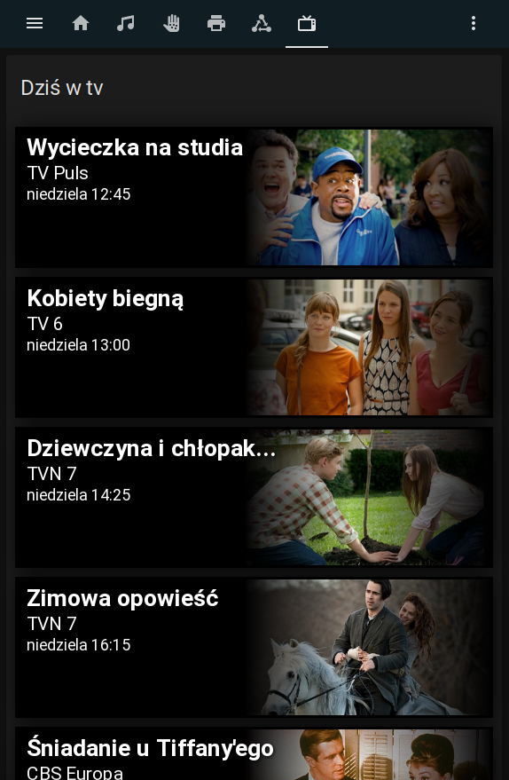

# Teleman
Teleman to dodatek do Home Assistant, który pobiera ze strony teleman.pl informacje o polecanych do obejrzenia filmów w TV. Dane wyświetlane są w karcie upcoming media card, którą należy zainstalować osobno.


<br>
<br>


# Instalacja 
1. Pobierz i zainstaluj <a href="https://github.com/custom-cards/upcoming-media-card">upcoming media card</a> 
   Karta jest dostępna w HACS.
2. Pobierz pliki i skopiuj do folderu <code>config</code>. Możesz dodać w hacs custom repository z adresem:
   <code>https://github.com/Gilumac/teleman.git</code>
3. W pliku <code>configuration.yaml</code> dodaj:
```yaml
    sensor:
    - platform: teleman
```
4. W edytorze yaml dla widoku dodaj wpis
```yaml
cards:
      - type: custom:upcoming-media-card
        entity: sensor.teleman
        title: Tytuł karty
        max: liczba wyświetlanych wpisów
        image_style: tryb widoku karty, fanart lub poster
        clock: 24(tryb zegara 12/24h)
```        
Przykład:
```yaml
- title: Dziś w tv
    path: dzis-w-tv
    icon: mdi:television-classic
    badges: []
    cards:
      - type: custom:upcoming-media-card
        entity: sensor.teleman
        title: Dziś w tv
        max: 15
        image_style: fanart
        clock: 24
```        
